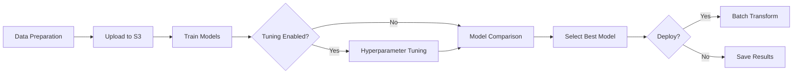
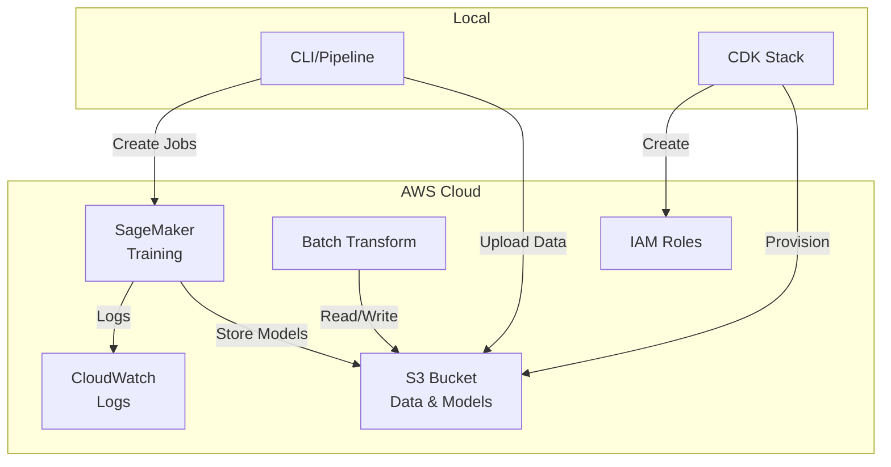

# Documentation Review - Improvement Opportunities

**Review Date:** 2026-02-11
**Reviewed Files:** README.md, ARCHITECTURE.md, CONTRIBUTING.md
**Branch:** claude/review-report-improvements-53GcG

---

## Executive Summary

The SageMaker ML Model Example project has solid foundational documentation covering the essential aspects of the project. However, there are significant opportunities to enhance clarity, completeness, and usability for different audiences (end users, developers, and contributors).

**Overall Quality:** Good (7/10)
**Priority Improvements:** 18 high-priority, 25 medium-priority, 12 low-priority items identified

---

## 1. README.md Analysis

### 1.1 High Priority Issues

#### Missing Project Badges (Line 1)
**Issue:** No status badges for build, test coverage, license, or version information
**Impact:** Users cannot quickly assess project health and status
**Recommendation:** Add badges after the title:
```markdown
# SageMaker ML Model Example

[](https://github.com/bojanderson/sagemaker-mlmodel-example/actions)
[](https://codecov.io/gh/bojanderson/sagemaker-mlmodel-example)
[](LICENSE)
[](https://www.python.org/downloads/)
```

#### No Table of Contents (Line 11)
**Issue:** Long README (310 lines) lacks navigation
**Impact:** Users struggle to find specific sections quickly
**Recommendation:** Add TOC after features section:
```markdown
## Table of Contents
- [Features](#features)
- [Project Structure](#project-structure)
- [Prerequisites](#prerequisites)
- [Installation](#installation)
- [Usage](#usage)
  - [Running the Pipeline Locally](#running-the-pipeline-locally-mock-mode)
  - [Running on SageMaker](#running-the-pipeline-on-sagemaker)
  - [Deploying Infrastructure](#deploying-infrastructure-with-cdk)
- [Running Tests](#running-tests)
- [Pipeline Components](#pipeline-components)
- [Configuration](#configuration)
- [Cost Considerations](#cost-considerations)
- [Contributing](#contributing)
- [License](#license)
```

#### Missing Quickstart Section
**Issue:** Users need to read extensively before getting started
**Impact:** Higher barrier to entry, slower onboarding
**Recommendation:** Add a quickstart section after the TOC:
```markdown
## Quickstart

Get up and running in 2 minutes:

```bash
# Clone and install
git clone https://github.com/bojanderson/sagemaker-mlmodel-example.git
cd sagemaker-mlmodel-example
pip install -r requirements.txt

# Run the pipeline in mock mode (no AWS required)
python src/run_pipeline.py --bucket demo-bucket --mock

# View results
cat model_comparison.json
```
```

#### Incomplete Prerequisites (Line 50-55)
**Issue:** Version requirements are vague ("Python 3.8+", no boto3 version, no Node.js version)
**Impact:** Users may encounter compatibility issues
**Recommendation:** Be more specific:
```markdown
## Prerequisites

- Python 3.8 - 3.11 (tested on 3.9 and 3.10)
- AWS Account with SageMaker access (for non-mock mode)
- AWS CLI v2.x configured with appropriate credentials
- boto3 >= 1.26.0
- sagemaker >= 2.100.0
- Node.js 14+ and npm (for CDK deployment only)
```

#### Missing Troubleshooting Section
**Issue:** No guidance when things go wrong
**Impact:** Users get stuck on common issues
**Recommendation:** Add troubleshooting section before Contributing:
```markdown
## Troubleshooting

### Common Issues

#### ImportError: No module named 'sagemaker'
Ensure you've installed all dependencies:
```bash
pip install -r requirements.txt
```

#### AWS Credentials Error
Configure AWS CLI with your credentials:
```bash
aws configure
```

#### Permission Denied on S3 Bucket
Ensure your IAM role has these permissions:
- s3:PutObject
- s3:GetObject
- sagemaker:CreateTrainingJob
- sagemaker:DescribeTrainingJob

#### Mock Mode Still Trying to Access AWS
Ensure you're using the `--mock` flag:
```bash
python src/run_pipeline.py --bucket my-bucket --mock
```

For more issues, check [GitHub Issues](https://github.com/bojanderson/sagemaker-mlmodel-example/issues)
```

#### Missing FAQ Section
**Issue:** Common questions aren't pre-answered
**Impact:** Repeated questions in issues/support
**Recommendation:** Add FAQ section:
```markdown
## Frequently Asked Questions

**Q: Can I use this with my own dataset?**
A: Yes! Modify `src/pipeline/data_preparation.py` to load and preprocess your data.

**Q: How do I add a new ML algorithm?**
A: See [CONTRIBUTING.md](CONTRIBUTING.md#adding-a-new-model) for detailed steps.

**Q: What AWS regions are supported?**
A: All regions that support SageMaker. Specify with `--region` flag.

**Q: Can I deploy real-time endpoints instead of batch?**
A: Not yet, but this is planned. Track issue #XX for updates.

**Q: How much will this cost to run?**
A: See [Cost Considerations](#cost-considerations). Mock mode is free.

**Q: Is this production-ready?**
A: This is an example/educational project. Review security and add monitoring before production use.
```

#### Security Considerations Buried in Cost Section (Line 268-278)
**Issue:** Security is only mentioned regarding costs, not as a dedicated concern
**Impact:** Users may miss important security considerations
**Recommendation:** Add dedicated security section or reference ARCHITECTURE.md security features

### 1.2 Medium Priority Issues

#### Missing Visual Diagrams
**Issue:** No architecture diagram or pipeline flow visualization
**Impact:** Harder to understand the system at a glance
**Recommendation:** Add a pipeline flow diagram after Features section (can use Mermaid in GitHub):
```markdown
## Architecture Overview


```

#### Inconsistent Code Block Formatting
**Issue:** Some commands use ```bash, others don't specify language
**Impact:** Inconsistent rendering and syntax highlighting
**Recommendation:** Use ```bash consistently for all shell commands

#### Example Output Uses Special Characters (Line 214-241)
**Issue:** Uses ✓ checkmarks that may not render in all terminals/systems
**Impact:** Poor display on some systems
**Recommendation:** Use standard ASCII alternatives like `[OK]` or `✓` with fallback mention

#### CDK Commands Location (Line 113-140)
**Issue:** CDK commands show absolute paths (cd src/cdk) but project structure shows cdk/ at root
**Impact:** Confusion about actual CDK location
**Recommendation:** Verify and correct the actual CDK directory location

#### Configuration Section Too Minimal (Line 246-266)
**Issue:** Only covers basic CLI options, no advanced configuration
**Impact:** Users can't customize beyond basic options
**Recommendation:** Document configuration files, environment variables, and advanced options:
```markdown
### Advanced Configuration

Create a `.sagemaker-config.json` file:
```json
{
  "training": {
    "instance_type": "ml.m5.2xlarge",
    "max_runtime_seconds": 3600
  },
  "hyperparameter_tuning": {
    "max_jobs": 20,
    "max_parallel_jobs": 3
  }
}
```
```

#### Missing Examples Directory
**Issue:** ARCHITECTURE.md mentions examples but none exist beyond examples.py
**Impact:** Users lack concrete usage examples
**Recommendation:** Create examples/ directory with:
- `basic_usage.py`
- `custom_dataset.py`
- `production_deployment.py`
- `monitoring_setup.py`

#### No Link to ARCHITECTURE.md or CONTRIBUTING.md
**Issue:** Related documentation not cross-referenced
**Impact:** Users don't discover additional documentation
**Recommendation:** Add at top of README:
```markdown
**Documentation:** [Architecture](ARCHITECTURE.md) | [Contributing](CONTRIBUTING.md) | [API Docs](docs/api.md)
```

#### Incomplete License Information
**Issue:** License referenced but type not specified in README
**Impact:** Users unclear about usage rights
**Recommendation:** Add license type to the License section:
```markdown
## License

This project is licensed under the MIT License - see [LICENSE](LICENSE) file for details.
```

### 1.3 Low Priority Issues

#### External Links Not Descriptive (Line 304-309)
**Issue:** Links section is generic
**Impact:** Users don't know what they'll find
**Recommendation:** Add descriptions:
```markdown
## Additional Resources

- [AWS SageMaker Documentation](https://docs.aws.amazon.com/sagemaker/) - Official SageMaker docs
- [SageMaker Python SDK](https://sagemaker.readthedocs.io/) - Python SDK reference
- [AWS CDK Documentation](https://docs.aws.amazon.com/cdk/) - Infrastructure as Code guide
- [XGBoost Documentation](https://xgboost.readthedocs.io/) - XGBoost algorithm details
- [scikit-learn Documentation](https://scikit-learn.org/) - scikit-learn reference
```

#### Contributing Section Minimal (Line 290-297)
**Issue:** Only references CONTRIBUTING.md, no inline guidance
**Impact:** Lower contribution likelihood
**Recommendation:** Add quick contribution steps inline

#### No Changelog Reference
**Issue:** No way to track version changes
**Impact:** Users can't see what's new or changed
**Recommendation:** Add CHANGELOG.md and reference it

---

## 2. ARCHITECTURE.md Analysis

### 2.1 High Priority Issues

#### Title/Filename Mismatch (Line 1)
**Issue:** File is "ARCHITECTURE.md" but title is "Implementation Summary"
**Impact:** Confusing purpose of document
**Recommendation:** Either:
- Rename to IMPLEMENTATION.md, or
- Change title to "Architecture & Implementation Guide"

#### No Architecture Diagrams
**Issue:** Document called ARCHITECTURE but contains no diagrams
**Impact:** Fails to convey architectural design visually
**Recommendation:** Add system architecture diagram showing:
- AWS Services interaction
- Data flow
- Component relationships
- Deployment architecture

Example addition:
```markdown
## System Architecture

### Component Diagram


```

#### Hardcoded Test Results (Line 122-127)
**Issue:** Specific test counts will become outdated
**Impact:** Document becomes stale, misleading
**Recommendation:** Either:
- Reference CI badge instead
- Use relative terms like "comprehensive test coverage"
- Auto-generate from test runs

#### Performance Metrics Without Context (Line 138-148)
**Issue:** Times given without specifying hardware/environment
**Impact:** Users have wrong expectations
**Recommendation:** Add context:
```markdown
## Performance

Mock pipeline execution (M1 MacBook Pro, 16GB RAM): ~10 seconds
- Data generation: ~2 seconds
- Model comparison: <1 second
- Result output: <1 second

Real SageMaker execution time (ml.m5.xlarge instances):
- Training (each model): 5-15 minutes
- Hyperparameter tuning (10 jobs): 30-60 minutes
- Batch transform: 5-10 minutes
```

#### Cost Estimates May Become Outdated (Line 150-159)
**Issue:** AWS pricing changes over time
**Impact:** Misleading cost information
**Recommendation:** Add disclaimer and last update date:
```markdown
## Cost Estimates

**Note:** Pricing as of February 2026 in us-east-1. Check [AWS Pricing](https://aws.amazon.com/sagemaker/pricing/) for current rates.
```

#### Future Enhancements Not Linked to Issues (Line 169-179)
**Issue:** Enhancement ideas listed but not tracked
**Impact:** Lost opportunity for community engagement
**Recommendation:** Link each to GitHub issue:
```markdown
## Future Enhancements

- [ ] Add more algorithms (Random Forest, Neural Networks) [#12]
- [ ] Add real-time endpoint deployment option [#15]
- [ ] Add model monitoring and drift detection [#23]
```

### 2.2 Medium Priority Issues

#### Security Features Listed But Not Detailed (Line 161-167)
**Issue:** Security features mentioned superficially
**Impact:** Users don't understand security posture
**Recommendation:** Expand security section:
```markdown
## Security Features

### Data Protection
1. **S3 Encryption**: Server-side encryption (SSE-S3) enabled by default
   - All data encrypted at rest
   - Configuration in `src/cdk/sagemaker_stack.py:45`

2. **Block Public Access**: All S3 buckets have public access blocked
   - Prevents accidental data exposure
   - Applied at bucket and account level

### Access Control
3. **IAM Least Privilege**: Roles have minimal required permissions
   - SageMaker execution role: training and inference only
   - Notebook role: additional read permissions
   - See `src/cdk/sagemaker_stack.py` for role definitions

4. **No Hardcoded Credentials**: Uses AWS IAM roles
   - Credentials managed by AWS
   - Temporary session tokens

### Data Integrity
5. **Versioning**: S3 bucket versioning enabled
   - Protects against accidental deletion
   - Enables rollback capabilities

### Security Recommendations
- Enable CloudTrail for audit logging
- Use VPC endpoints for private connectivity
- Implement bucket policies for additional access control
- Regular security assessments with AWS Security Hub
- Enable MFA for production accounts
```

#### Missing API/Module Documentation
**Issue:** No reference documentation for code modules
**Impact:** Developers need to read source code
**Recommendation:** Add API documentation section or link to auto-generated docs

#### No Decision Records
**Issue:** No explanation of why certain design decisions were made
**Impact:** Future developers may not understand rationale
**Recommendation:** Add Architecture Decision Records (ADRs):
```markdown
## Key Design Decisions

### ADR-001: Use SageMaker Built-in Algorithms
**Decision:** Use SageMaker built-in containers instead of custom Docker images
**Rationale:** Faster development, maintained by AWS, optimized performance
**Consequences:** Limited to AWS-supported algorithms, some customization constraints

### ADR-002: Support Mock Mode
**Decision:** Implement mock mode for testing without AWS
**Rationale:** Enable development/testing without AWS costs or credentials
**Consequences:** Additional code complexity, need to maintain mock behavior
```

### 2.3 Low Priority Issues

#### Version Numbers Hardcoded (Line 14, 22)
**Issue:** Container versions specified may become outdated
**Impact:** Minor - users may want newer versions
**Recommendation:** Document how to check for latest versions or use variables

#### Maintenance Section Generic (Line 181-188)
**Issue:** General statements without specifics
**Impact:** Doesn't help future maintainers
**Recommendation:** Add specific maintenance tasks and schedules

---

## 3. CONTRIBUTING.md Analysis

### 3.1 High Priority Issues

#### No Code of Conduct (Throughout)
**Issue:** Missing code of conduct reference or inclusion
**Impact:** Unclear community standards
**Recommendation:** Add CODE_OF_CONDUCT.md and reference it:
```markdown
## Code of Conduct

This project adheres to the [Contributor Covenant Code of Conduct](CODE_OF_CONDUCT.md).
By participating, you are expected to uphold this code.
```

#### No Commit Message Guidelines (Line 72-76)
**Issue:** Says "write clear commit messages" but no format specified
**Impact:** Inconsistent commit history
**Recommendation:** Add commit message format section:
```markdown
## Commit Message Format

Follow the [Conventional Commits](https://www.conventionalcommits.org/) specification:

```
<type>(<scope>): <subject>

<body>

<footer>
```

**Types:**
- `feat`: New feature
- `fix`: Bug fix
- `docs`: Documentation changes
- `test`: Adding or updating tests
- `refactor`: Code refactoring
- `chore`: Maintenance tasks

**Examples:**
```
feat(training): add support for Linear Learner algorithm

Implements Linear Learner as a fourth model option with
hyperparameter tuning support.

Closes #45
```

```
fix(data-prep): handle missing values in dataset

Previously would crash on NaN values. Now fills with mean.
```
```

#### Missing Issue Templates
**Issue:** No guidance on reporting bugs or requesting features
**Impact:** Low-quality issue reports
**Recommendation:** Create `.github/ISSUE_TEMPLATE/` with:
- `bug_report.md`
- `feature_request.md`
- `question.md`

#### No Pull Request Template
**Issue:** PRs may lack necessary information
**Impact:** Slower review process
**Recommendation:** Create `.github/PULL_REQUEST_TEMPLATE.md`:
```markdown
## Description
<!-- Describe your changes -->

## Type of Change
- [ ] Bug fix
- [ ] New feature
- [ ] Breaking change
- [ ] Documentation update

## Testing
- [ ] All tests pass
- [ ] Added new tests
- [ ] Tested in mock mode
- [ ] Tested with real SageMaker (if applicable)

## Checklist
- [ ] Code follows project style (black, flake8)
- [ ] Documentation updated
- [ ] CHANGELOG.md updated
- [ ] Self-review completed
```

#### No Release Process Documentation (Missing)
**Issue:** No information about versioning or releases
**Impact:** Unclear how project is versioned
**Recommendation:** Add release process section:
```markdown
## Release Process

This project follows [Semantic Versioning](https://semver.org/).

### Creating a Release

1. Update version in `setup.py`
2. Update `CHANGELOG.md` with release notes
3. Create release commit: `git commit -m "chore: release v1.2.3"`
4. Tag the release: `git tag -a v1.2.3 -m "Release v1.2.3"`
5. Push: `git push && git push --tags`
6. Create GitHub release with changelog

### Version Bumping

- **MAJOR** (x.0.0): Breaking changes
- **MINOR** (1.x.0): New features, backward compatible
- **PATCH** (1.0.x): Bug fixes
```

### 3.2 Medium Priority Issues

#### Development Dependencies Incomplete (Line 19-22)
**Issue:** Only mentions pytest, black, flake8
**Impact:** Missing useful dev tools
**Recommendation:** Add comprehensive dev dependencies:
```markdown
3. Install development dependencies:
```bash
pip install pytest pytest-cov pytest-mock black flake8 mypy pre-commit
```

4. Set up pre-commit hooks (recommended):
```bash
pre-commit install
```
```

#### No Testing Strategy Guidance (Line 24-39)
**Issue:** Shows how to run tests but not how to write them
**Impact:** Contributors may write poor tests
**Recommendation:** Add testing guidance:
```markdown
## Writing Tests

### Test Structure
- Unit tests: Test individual functions/classes in isolation
- Integration tests: Test complete workflows

### Test Naming
- Test files: `test_<module>.py`
- Test functions: `test_<function>_<scenario>()`

### Examples

```python
def test_prepare_data_creates_train_test_split():
    """Test that data preparation creates proper train/test split."""
    data = prepare_data(test_size=0.2)
    assert len(data['train']) == 0.8 * len(data['all'])
    assert len(data['test']) == 0.2 * len(data['all'])
```

### Mocking
Use pytest fixtures for common mocks:
```python
@pytest.fixture
def mock_sagemaker_session():
    with patch('sagemaker.Session') as mock:
        yield mock
```
```

#### Missing Backwards Compatibility Policy (Missing)
**Issue:** No guidance on maintaining compatibility
**Impact:** Breaking changes may be introduced carelessly
**Recommendation:** Add compatibility section

#### No Review Process Timeline (Missing)
**Issue:** Contributors don't know when to expect reviews
**Impact:** Frustration with delays
**Recommendation:** Add expected timeline:
```markdown
## Review Process

- Initial review: Within 3 business days
- Feedback response: Within 5 business days
- Final decision: Within 2 weeks

If your PR hasn't been reviewed, feel free to ping maintainers after 5 days.
```

### 3.3 Low Priority Issues

#### No Branch Naming Convention (Missing)
**Issue:** Line 56 shows example but no convention
**Impact:** Inconsistent branch names
**Recommendation:** Document convention:
```markdown
### Branch Naming

- Features: `feature/description`
- Bug fixes: `fix/description`
- Documentation: `docs/description`
- Refactoring: `refactor/description`
```

#### Missing Labels Documentation
**Issue:** No information about GitHub labels for issues/PRs
**Impact:** Contributors can't categorize appropriately
**Recommendation:** Document label usage

---

## 4. Cross-Cutting Issues

### 4.1 Documentation Structure

**Issue:** Documentation scattered across multiple files without clear hierarchy
**Recommendation:** Create documentation structure:
```
docs/
├── getting-started/
│   ├── quickstart.md
│   ├── installation.md
│   └── first-pipeline.md
├── guides/
│   ├── custom-datasets.md
│   ├── custom-algorithms.md
│   ├── production-deployment.md
│   └── monitoring.md
├── reference/
│   ├── api.md
│   ├── cli.md
│   └── configuration.md
└── development/
    ├── architecture.md
    ├── testing.md
    └── contributing.md
```

### 4.2 Missing Documentation

**Critical Missing Documents:**
1. **CHANGELOG.md** - Version history and changes
2. **SECURITY.md** - Security policy and vulnerability reporting
3. **CODE_OF_CONDUCT.md** - Community guidelines
4. **API Documentation** - Auto-generated from docstrings
5. **Migration Guides** - For breaking changes
6. **Deployment Guide** - Production deployment best practices

### 4.3 Documentation Audience

**Issue:** Documentation mixes user and developer content
**Recommendation:** Separate by audience:
- **README.md**: End users wanting to use the pipeline
- **ARCHITECTURE.md**: Developers wanting to understand the system
- **CONTRIBUTING.md**: Contributors wanting to modify the code
- **docs/**: Detailed guides for all audiences

### 4.4 Maintenance

**Issue:** No process for keeping documentation updated
**Recommendation:** Add documentation maintenance policy:
```markdown
## Documentation Standards

1. **Code changes require doc updates**: PRs with code changes must update relevant docs
2. **Quarterly doc review**: Review all docs every 3 months for accuracy
3. **Version-specific docs**: Tag documentation with version numbers
4. **Example validation**: CI/CD validates code examples in documentation
```

---

## 5. Prioritized Improvement Roadmap

### Phase 1: Critical Fixes (Week 1)

1. **README.md**
   - [ ] Add project badges
   - [ ] Add table of contents
   - [ ] Add quickstart section
   - [ ] Add troubleshooting section
   - [ ] Clarify prerequisites with specific versions

2. **ARCHITECTURE.md**
   - [ ] Fix title/filename alignment
   - [ ] Add architecture diagrams
   - [ ] Add date to cost estimates

3. **CONTRIBUTING.md**
   - [ ] Add commit message guidelines
   - [ ] Add testing guidance
   - [ ] Document development dependencies

4. **New Files**
   - [ ] Create CHANGELOG.md
   - [ ] Create CODE_OF_CONDUCT.md
   - [ ] Create SECURITY.md
   - [ ] Create PR template
   - [ ] Create issue templates

### Phase 2: Enhancement (Week 2-3)

1. **README.md**
   - [ ] Add FAQ section
   - [ ] Add architecture diagram
   - [ ] Improve configuration documentation
   - [ ] Add security section

2. **ARCHITECTURE.md**
   - [ ] Expand security features section
   - [ ] Add Architecture Decision Records
   - [ ] Link future enhancements to issues
   - [ ] Add context to performance metrics

3. **CONTRIBUTING.md**
   - [ ] Add release process documentation
   - [ ] Add review timeline expectations
   - [ ] Add branch naming conventions
   - [ ] Document backwards compatibility policy

4. **New Content**
   - [ ] Create examples/ directory with samples
   - [ ] Create docs/ directory structure
   - [ ] Add API documentation (auto-generated)

### Phase 3: Polish (Week 4)

1. **Cross-References**
   - [ ] Link related documentation
   - [ ] Add navigation between docs
   - [ ] Cross-reference security policies

2. **Validation**
   - [ ] Test all code examples
   - [ ] Verify all links work
   - [ ] Check formatting consistency
   - [ ] Validate version numbers

3. **Automation**
   - [ ] Add doc linting to CI/CD
   - [ ] Auto-generate parts of docs
   - [ ] Add link checking

---

## 6. Specific File Recommendations

### README.md Target State (Lines to modify)

| Line Range | Current | Recommended Change |
|-----------|---------|-------------------|
| 1-2 | Title only | Add badges |
| 11 | Features | Add TOC before features |
| 11 | Features | Add Quickstart after TOC |
| 50-55 | Vague prerequisites | Specific versions |
| After 245 | N/A | Add Troubleshooting section |
| After 279 | N/A | Add FAQ section |
| 268-278 | Cost section | Split out security |
| 304-309 | Links | Add descriptions |

### ARCHITECTURE.md Target State

| Section | Current State | Recommended State |
|---------|--------------|------------------|
| Title | Implementation Summary | Architecture & Implementation Guide |
| After Overview | N/A | Add component diagram |
| Line 122-127 | Hardcoded test counts | Dynamic or removed |
| Line 138-148 | Performance without context | Add environment details |
| Line 150-159 | Cost estimates | Add date and disclaimer |
| Line 161-167 | Minimal security | Expanded section |
| After Maintenance | N/A | Add ADRs section |

### CONTRIBUTING.md Target State

| Section | Current State | Recommended State |
|---------|--------------|------------------|
| Top | N/A | Add Code of Conduct |
| Line 72-76 | Generic | Commit message format |
| After Code Style | N/A | Testing guidelines |
| End | N/A | Release process |
| End | N/A | Review timeline |

---

## 7. Success Metrics

To measure documentation improvement success:

1. **Quantitative Metrics**
   - Reduce average time-to-first-contribution from setup
   - Reduce number of "how do I..." issues
   - Increase contributor retention rate
   - Reduce documentation-related PR comments

2. **Qualitative Metrics**
   - User feedback on documentation clarity
   - Maintainer feedback on PR quality
   - Documentation health score (tools like Vale)

3. **Coverage Metrics**
   - All public APIs documented
   - All CLI commands documented
   - All configuration options documented
   - All examples tested in CI

---

## 8. Conclusion

The current documentation provides a solid foundation but has room for significant improvement in:

1. **Accessibility**: Easier navigation, clearer structure
2. **Completeness**: Missing critical sections and files
3. **Maintenance**: No process for keeping docs updated
4. **Audience Targeting**: Better separation of user vs developer content

Implementing the Phase 1 improvements would provide immediate value to users and contributors. The subsequent phases would establish a sustainable documentation practice.

**Estimated Effort:**
- Phase 1: 16-20 hours
- Phase 2: 24-32 hours
- Phase 3: 12-16 hours
- **Total: 52-68 hours** (approximately 1.5-2 weeks for one person)

**Return on Investment:**
- Reduced support burden (fewer questions)
- Increased contribution quality
- Better project perception and adoption
- Easier onboarding for new team members

---

## Appendix A: Documentation Templates

### Template: Architecture Decision Record (ADR)

```markdown
# ADR-XXX: [Title]

**Status:** [Proposed | Accepted | Deprecated | Superseded]
**Date:** YYYY-MM-DD
**Deciders:** [List of people involved]

## Context
[Describe the context and problem statement]

## Decision
[Describe the decision and why]

## Consequences
**Positive:**
- [Benefit 1]
- [Benefit 2]

**Negative:**
- [Tradeoff 1]
- [Tradeoff 2]

**Neutral:**
- [Impact 1]

## Alternatives Considered
1. **Alternative 1:** [Description and why rejected]
2. **Alternative 2:** [Description and why rejected]
```

### Template: CHANGELOG.md

```markdown
# Changelog

All notable changes to this project will be documented in this file.

The format is based on [Keep a Changelog](https://keepachangelog.com/en/1.0.0/),
and this project adheres to [Semantic Versioning](https://semver.org/spec/v2.0.0.html).

## [Unreleased]

### Added
- Feature in development

## [1.0.0] - 2026-01-15

### Added
- Initial release
- XGBoost, KNN, and scikit-learn GBM model support
- Hyperparameter tuning
- Batch deployment
- CDK infrastructure code
- Mock mode for testing

### Changed
- N/A

### Deprecated
- N/A

### Removed
- N/A

### Fixed
- N/A

### Security
- N/A
```

---

**Review prepared by:** Claude Code
**Intended audience:** Project maintainers and contributors
**Next steps:** Review recommendations, prioritize improvements, create GitHub issues for tracking
